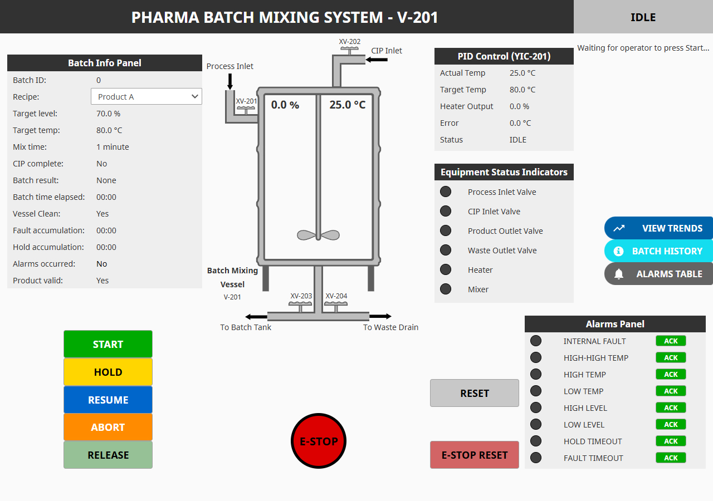

# Pharma Batch Mixing System  
### PLC Programming & SCADA Demonstration Project  

**[→ Watch the demo video](https://www.youtube.com/watch?v=euDJXR5xoyw)**

  
    
  <em>Idle state. Vessel empty, clean, and ready for batch start.</em>

***

## Overview

This project demonstrates a simulated pharmaceutical batch mixing system controlled using PLC logic and visualized through Ignition SCADA.

The system performs:

* Automated batch filling  
* Temperature control and heating  
* Mixing under controlled conditions  
* Batch discharge and validation  
* Clean-In-Place (CIP) cycle  

The objective is to execute a complete batch process using structured state-machine logic, while ensuring product quality through strict control of temperature, level, and fault conditions.

The control logic was developed in Connected Components Workbench (CCW) using Structured Text. The same control logic was then manually implemented inside Ignition Designer using a Gateway Timer Script to simulate PLC–SCADA integration.

No direct PLC communication (e.g., EtherNet/IP or Modbus TCP) was used in this demonstration.

***

## Process Description

The system consists of a mixing vessel equipped with an impeller, heating system, and multiple inlets/outlets.

* Process fluid enters through a dedicated inlet.  
* The vessel is heated and mixed to reach target conditions.  
* Product is discharged to a batch container when valid.  
* Invalid or aborted batches are diverted to waste.  
* A CIP cycle fills, agitates, and drains the vessel to restore clean conditions.  

Strict control of temperature and level is required to ensure batch quality and safe operation.

***

## Control Strategy

### Batch Sequencing
Implements a multi-phase state machine controlling the full batch lifecycle: Idle → Filling → Heating → Mixing → Draining → CIP → Complete. Includes transitions for hold, abort, and emergency stop conditions.

### Temperature Control
Maintains vessel temperature at setpoint using a PID-controlled heater. The system applies proportional and integral control with output limiting to ensure stable heating and prevent overshoot.

### Level Control
Controls vessel filling and draining using on/off valves. Level thresholds ensure proper transitions between phases and prevent overflow or dry operation.

### Fault and Alarm Handling
Monitors temperature, level, and system conditions. Includes:

* Minor faults (recoverable conditions)  
* Critical faults (force batch termination)  
* Alarm latching and acknowledgment logic  
* Time-based fault accumulation tracking (hold and recovery limits) 

Batch validity is determined based on fault occurrence and process conditions.

### Batch History Logging
Automatically records completed batch data into a structured database table. Logged data includes batch ID, recipe parameters, process results, duration, temperature metrics, alarm activity, and fault durations.

A snapshot of key values is captured at batch termination, while trend data provides continuous visibility of temperature and level throughout the batch, enabling detailed post-batch analysis.

***

## System Structure

### PLC Development
* Developed in Connected Components Workbench (CCW)
* Structured Text programming
* State machine sequencing
* PID control loop
* Alarm and fault handling logic

### SCADA Implementation (Ignition Maker Edition)
* HMI visualization
* Real-time trends and batch monitoring
* Operator controls (Start / Hold / Resume / Abort / Reset)
* Manual reimplementation of PLC logic using a Gateway Timer Script

***

## Project Structure

### /demo
Contains:
* youtube-link.txt  
  YouTube link to project walkthrough video

***

### /diagrams
Contains:
* pharma-batch-p&id.pdf  
  Process and instrumentation diagram showing vessel, inlets, outlets, and instrumentation.

* pharma-batch-p&id-description.pdf 
  Written explanation of p&id.

***

### /logic
Contains:
* 1-pharma-batch-state-machine.txt  
  Implements full batch sequencing including hold, abort, and fault transitions.

* 2-pharma-batch-pid.txt  
  Contains PID control logic for vessel heating.

* 3-pharma-batch-simulation.txt  
  Simulates level, temperature, and process dynamics.

* variables.csv  
  List of PLC variables with definitions.

***

### /screenshots
Contains visual documentation of:

* HMI operational states (Idle, Filling, Heating, Mixing, Hold, Fault, Draining, CIP, Complete, E-Stop)
* Live tag browser during runtime
* Trend displays for temperature and level over a full batch cycle
* Batch history and alarm tables
* Gateway Timer Script implementation

***

## Design Highlights

✓ State Machine Design — Multi-phase batch sequencing with full lifecycle control

✓ Batch Validation Logic — Product acceptance based on process conditions and fault history

✓ Fault Handling Strategy — Separation of minor and critical faults with accumulation-based logic

✓ CIP Integration — Automated cleaning cycle with verification of vessel readiness

✓ Batch History Logging — Automatic storage of batch data for traceability and analysis

✓ Process Simulation — Realistic testing of batch behavior without hardware

***

## Available for Contract Work

If you're looking for PLC and SCADA automation expertise, I'm available for contract projects.

**Contact:** marcbelleyp@gmail.com | [LinkedIn](https://www.linkedin.com/in/marc-belleyp) | [GitHub](https://github.com/marc-belleyp)

**Typical scope:** Control logic development, PID implementation, troubleshooting, and HMI design.